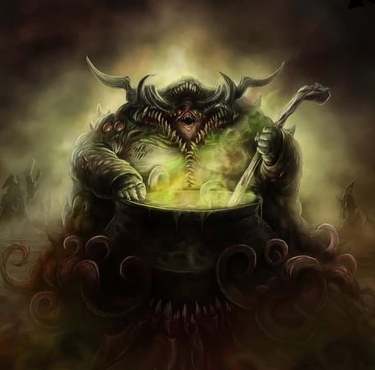

# Nurgle-Themed Telegram Bot



## Introduction

Welcome to the Nurgle-Themed Telegram Bot, a fun project built using Ruby. This bot is inspired by the Nurgle faction from the Warhammer 40k universe and is designed to provide users with a variety of Nurgle-themed interactions and information.

## Features

- 🤢 Nurgle Greetings: The bot can greet users with infectious Nurgle-themed messages.

- 💀 Nurgle Trivia: Get interesting facts and trivia about the Nurgle faction.

- 🤖 Custom Commands: Add your own commands to extend the bot's functionality.

## Prerequisites

Before you can run this bot, ensure that you have the following gems installed:

- [telegram-bot-ruby](https://rubygems.org/gems/telegram-bot-ruby) (version 1.0 or higher)
- [json](https://rubygems.org/gems/json)
- [net-http-persistent](https://rubygems.org/gems/net-http-persistent) (version 2.9.4 or higher)

You can install these gems using the following commands:

```bash
gem install telegram-bot-ruby -v '1.0'
gem install json
gem install net-http-persistent -v '2.9.4'
```

## Installation

1. Clone this repository to your local machine:

```bash
git clone https://github.com/yourusername/papa-nurgle-bot.git
```

2. Navigate to the project folder:

```bash
cd papa-nurgle-bot
```

3. Start the bot by running the main script:

```bash
ruby bin/main.rb
```

The bot should now be up and running, ready to infect your Telegram chats with Nurgle's blessings!

## Usage

1. Start a chat with your bot on Telegram.
2. Use the available commands to interact with the bot and enjoy Nurgle-themed content.

## Commands

Here are some example commands to get you started:

- `/greet`: Receive a Nurgle-inspired greeting.
- `/trivia`: Get interesting Nurgle trivia.
- `/help`: See a list of available commands.

Feel free to extend the bot's functionality by adding your own custom commands. You can find more information in the code.

## Contribute

We welcome contributions to make this Nurgle-themed Telegram Bot even more infectious. If you have ideas, improvements, or bug fixes, please submit a pull request.

## Disclaimer

This project is fan-made and not affiliated with Games Workshop or the Warhammer 40k universe in any official capacity. It's purely for entertainment and educational purposes.

## License

This project is licensed under the [MIT License](LICENSE).

## Contact

If you have any questions or suggestions, feel free to contact the bot creator at `rahal.aires@gmail.com`.

Enjoy your Nurgle-themed Telegram Bot! 🤢💀